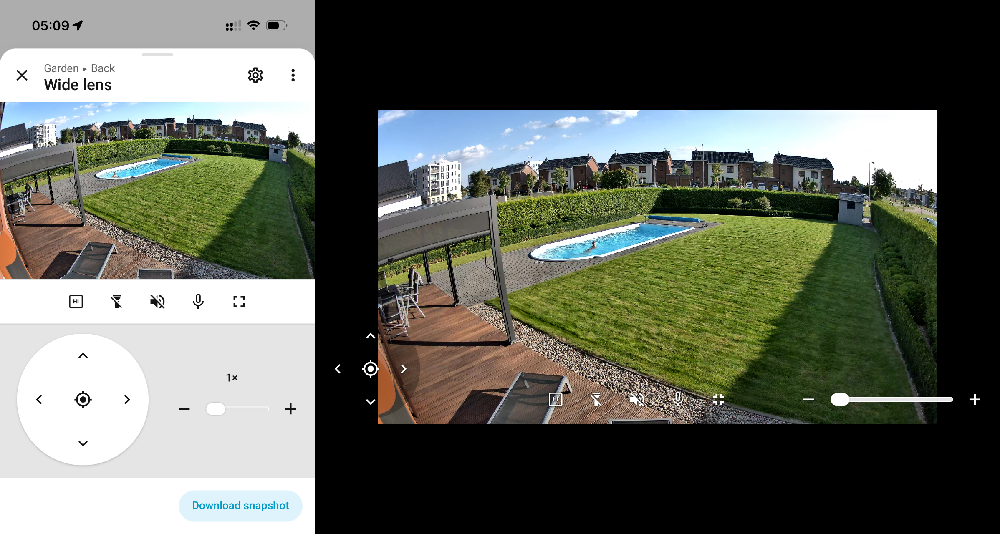

# Reolink Baichuan WebRTC for Home Assistant

[Polski](README_PL.md) · [Deutsch](README_DE.md)

> **Low-latency Reolink camera streaming and integrated controls in the standard Home Assistant interface.**

```text
Reolink camera <-> Baichuan <-> go2rtc <-> WebRTC <-> Home Assistant
```

This community project extends the standard Home Assistant camera dialog with
fast live video, stream quality selection, multi-lens support, PTZ, zoom,
floodlight control and two-way audio. It uses the entities created by the
official Reolink integration and does not add a separate dashboard or Lovelace
card.

Author and maintainer: **Bartosz Supcziński** — <bartek@env.pl>

## Why this project exists

Home Assistant exposes advanced Reolink functions as separate entities. Its
standard camera dialog does not combine them into one camera-oriented
interface, and the normal RTSP/HLS path can add startup delay. This project
routes the native Baichuan stream through go2rtc and augments the existing
dialog without replacing the Reolink integration.

## Interface

The same camera dialog adapts to portrait, landscape and full-screen layouts.
The image below shows the normal mobile view and the full-screen landscape
view.



## Features

### Video

- Native Reolink Baichuan source for go2rtc.
- WebRTC as the primary browser path.
- Automatic HLS fallback in clients without WebRTC.
- LO and HI profiles backed by the Reolink `sub` and `main` streams.
- Low-resolution thumbnails in Home Assistant area views.
- The last thumbnail or video frame remains visible while live video starts or
  the quality profile changes.
- Video uses `contain` sizing to preserve the complete frame.

### Camera controls

- PTZ directional control.
- Return to the camera's saved monitor point.
- Digital zoom for the TrackMix wide lens.
- Camera-controlled hybrid zoom for TrackMix and optical zoom for E1 Zoom.
- Current camera zoom setting read directly from the camera.
- Optimistic slider movement with the command sent when the slider is
  released.
- Dragging of a locally enlarged wide-lens image.
- Floodlight control when the Reolink integration exposes a light entity.

### Audio

- Camera audio playback in the browser.
- Microphone talkback to the camera.
- A separate audio element prevents audio changes from restarting the picture
  on iOS.
- Audio is converted to Opus only while a camera view is active.

### Interface integration

- Home Assistant icons, colors, typography and spacing.
- Polish labels when Home Assistant uses Polish; English labels for every
  other interface language.
- Automatic wide-lens and zoom-lens names for supported cameras.
- Controls below the picture in portrait mode.
- Controls over the picture in landscape and full-screen modes.
- Full-screen orientation handling with an iOS fallback.
- Camera thumbnail refresh after a mobile application resumes.
- Recovery for a stalled Home Assistant back action after an application
  resumes.

## Compatibility

### Home Assistant

The current release targets **Home Assistant Core 2026.8.x installed as a
Python service**. Home Assistant OS, Container and supervised installations are
not installation targets because this project installs a host systemd service
and a custom go2rtc binary.

The frontend module uses internal Home Assistant web components, and the
backend integration extends an internal go2rtc provider method. A Home
Assistant frontend or Core update can therefore require a compatibility
update even when the public camera entities remain unchanged.

### Cameras

- Reolink TrackMix WiFi;
- Reolink E1 Zoom.

The official Reolink integration must expose the `main`, `sub`, PTZ, zoom
and light entities supported by the camera. Functions unavailable on a
particular model are omitted from the dialog.

### Clients

- Safari and Chromium-based browsers use WebRTC when available.
- Home Assistant mobile applications use WebRTC when their embedded browser
  exposes it.
- The Home Assistant macOS application uses HLS when its embedded view does
  not expose WebRTC.

### go2rtc

The supported build uses:

- repository: `fzurita/go2rtc`;
- base commit: `78de4806a929e2bd77d7acad07e337ef53c09fd2`;
- latency fix: `092ae6e2eca3afb3f439ecbd69a99785c816d953`.

`scripts/build-go2rtc.sh` reproduces this build. Revision
`e8952ef99d91fe10c85836934c5ecd28b37ff7fa` is not used because it can stop
some 4K H.265 streams after the first frame.

## Requirements

- Linux host running Home Assistant Core as the `homeassistant` user;
- Home Assistant Core 2026.8.x;
- the official Home Assistant Reolink integration already configured;
- Git, Go and a working C toolchain for the one-time go2rtc build;
- root access to the Home Assistant host;
- TCP and UDP port 8555 reachable from camera clients.

## Security model

- Camera credentials are read from the existing Home Assistant Reolink config
  entry and are not stored in this repository.
- go2rtc API listens only on `127.0.0.1:1984`.
- the local RTSP endpoint listens only on `127.0.0.1:8554`.
- WebRTC media uses TCP and UDP port 8555.
- the go2rtc service runs as the unprivileged `go2rtc` user with systemd
  hardening.
- the repository contains no camera addresses, credentials, Home Assistant
  tokens or entity registry copies.

Remote access still uses the authenticated Home Assistant connection on port
8123. If remote WebRTC is required, forward TCP and UDP 8555 to the Home
Assistant host without exposing ports 1984 or 8554.

## Repository layout

| Path | Purpose |
|---|---|
| `custom_components/reolink_baichuan_stream/` | Home Assistant backend integration |
| `frontend/reolink-webrtc-first.js` | Camera dialog and stream handling |
| `config/go2rtc.yaml.example` | Private go2rtc API, RTSP and WebRTC listeners |
| `systemd/go2rtc.service` | Hardened host service |
| `scripts/build-go2rtc.sh` | Reproducible go2rtc build |
| `scripts/install.sh` | Installation of project files |
| `docs/images/` | Public README images |

## Installation

### 1. Configure Reolink in Home Assistant

Add every camera through the official **Reolink** integration and confirm that
the standard camera entities work before installing this project.

### 2. Download the repository

```bash
git clone https://github.com/supczinskib/reolink-baichuan-ha.git
cd reolink-baichuan-ha
```

### 3. Build and install go2rtc

```bash
./scripts/build-go2rtc.sh
sudo install -m 0755 go2rtc /usr/local/bin/go2rtc
```

Create the service account if it does not exist:

```bash
id go2rtc >/dev/null 2>&1 || sudo useradd --system --home /var/lib/go2rtc --create-home --shell /usr/sbin/nologin go2rtc
```

Install the configuration:

```bash
sudo install -d -o go2rtc -g go2rtc -m 0700 /var/lib/go2rtc
sudo install -o go2rtc -g go2rtc -m 0600 config/go2rtc.yaml.example /var/lib/go2rtc/go2rtc.yaml
```

Edit `/var/lib/go2rtc/go2rtc.yaml` and replace `192.0.2.10` with the LAN
address of the Home Assistant host.

### 4. Install the Home Assistant files

```bash
sudo ./scripts/install.sh
```

The default Home Assistant configuration directory is
`/var/lib/homeassistant`. Set `HA_CONFIG` when a different directory is
used:

```bash
sudo HA_CONFIG=/path/to/homeassistant ./scripts/install.sh
```

### 5. Configure Home Assistant

Add the following entries to `configuration.yaml`:

```yaml
frontend:
  extra_module_url:
    - /local/reolink-webrtc-first.js?v=1.0.0

stream:
  ll_hls: true
  segment_duration: 2
  part_duration: 0.2

go2rtc:
  url: http://127.0.0.1:1984

reolink_baichuan_stream:
```

Merge the `frontend` section with an existing section instead of creating a
second key.

### 6. Start the services

```bash
sudo systemctl daemon-reload
sudo systemctl enable --now go2rtc.service
sudo systemctl restart home-assistant.service
```

Confirm that both services are active:

```bash
systemctl is-active go2rtc.service home-assistant.service
```

### 7. Enable camera entities

In **Settings → Devices & services → Entities**, enable the Reolink
`main` and `sub` camera entities. The `sub` cameras may remain hidden
from automatically generated area views; the frontend module still uses them
for LO video and thumbnails.

Open each camera from an area view and verify:

1. LO and HI video;
2. speaker and microphone;
3. PTZ and monitor-point return;
4. zoom;
5. floodlight where available;
6. portrait, landscape and full-screen layouts.

## Operation

LO is the default profile and uses less bandwidth. The LO/HI button switches
between the camera's `sub` and `main` entities. The stream transition keeps
the last frame visible until the new profile produces video.

The zoom slider updates visually while it is moved and sends one command after
release. On TrackMix, the range up to about 2.5× uses the wide view, the camera
then switches to its fixed-focal-length telephoto lens, and further enlargement
up to 6× is digital. Returning to the monitor point also resets local digital
zoom for a wide lens.

The speaker button enables sound from the camera. The microphone button asks
the browser for microphone permission and opens the talkback channel. Closing
the camera dialog closes media sessions.

## Updating

```bash
git pull --ff-only
sudo ./scripts/install.sh
sudo systemctl restart home-assistant.service
```

Rebuild and reinstall go2rtc only when the pinned commits in
`scripts/build-go2rtc.sh` change.

After a Home Assistant update, verify video startup, LO/HI switching, audio,
PTZ, zoom, thumbnails, full screen and back navigation.

## Troubleshooting

### No live image

- Confirm that `go2rtc.service` is active.
- Confirm that `http://127.0.0.1:1984` is reachable from the Home Assistant
  host.
- Confirm that TCP and UDP 8555 are not blocked between the client and the
  Home Assistant host.
- Verify that the `main` and `sub` camera entities are enabled.
- Check `journalctl -u go2rtc.service` and the Home Assistant log.

### WebRTC is unavailable

The frontend automatically selects HLS in an incompatible embedded browser.
An HLS picture has higher latency but should remain functional. Test in Safari
or Chrome to distinguish a client limitation from a camera or go2rtc problem.

### Audio or microphone does not work

- Allow microphone access for the Home Assistant origin.
- Confirm that the Reolink user account has permission to use camera audio.
- Confirm that the `sub` stream is enabled.
- Close other applications that may hold the camera talkback channel.

### Controls are missing

Confirm that the official Reolink integration exposes the corresponding
button, number, switch or light entity. Hidden entities can be used; disabled
entities cannot.

### Problems after a Home Assistant update

Reload the page without cache. If the problem remains, compare the installed
Home Assistant version with the supported version above. A frontend structure
or internal provider change can require a project update.

## Uninstallation

1. Remove `reolink_baichuan_stream:`, the `go2rtc:` entry and
   `/local/reolink-webrtc-first.js` from `configuration.yaml`.
2. Stop and disable `go2rtc.service`.
3. Remove:
   - `/var/lib/homeassistant/custom_components/reolink_baichuan_stream/`;
   - `/var/lib/homeassistant/www/reolink-webrtc-first.js`;
   - `/etc/systemd/system/go2rtc.service`;
   - `/usr/local/bin/go2rtc`;
   - `/var/lib/go2rtc/`.
4. Reload systemd and restart Home Assistant.

```bash
sudo systemctl disable --now go2rtc.service
sudo systemctl daemon-reload
sudo systemctl restart home-assistant.service
```

The official Reolink integration and its entities remain available.

## License

Copyright (C) 2026 Bartosz Supcziński.

This project is licensed under the MIT License. See [LICENSE](LICENSE).

## Support

- Author and maintainer: **Bartosz Supcziński**, <bartek@env.pl>.

When reporting a problem, include the Home Assistant version, browser or
application version, camera model, firmware version and relevant sanitized
logs. Remove passwords, tokens, camera addresses and network identifiers.

This is an independent community project and is not an official Reolink,
go2rtc or Home Assistant product.
